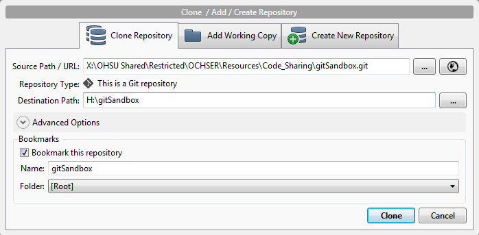
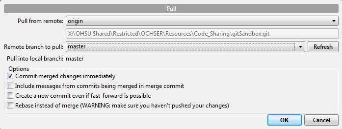
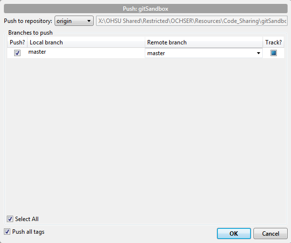
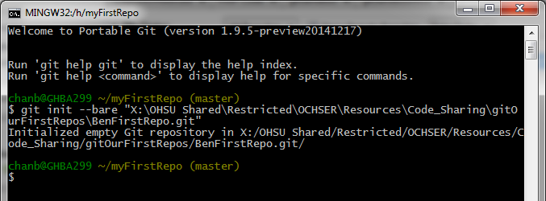

# gitSandbox
Sandbox to play with git and SourceTree

## Prerequisite

You may need a Markdown viewer/reader extension for your web broswer to properly view this `README.md`.

* Chrome
    * [Markdown Preview Plus](https://chrome.google.com/webstore/detail/markdown-preview-plus/febilkbfcbhebfnokafefeacimjdckgl?hl=en-US)
    * [Markdown Reader](https://chrome.google.com/webstore/detail/markdown-reader/gpoigdifkoadgajcincpilkjmejcaanc?hl=en)
* Firefox
    * [Markdown Viewer](https://addons.mozilla.org/en-us/firefox/addon/markdown-viewer/)
* Internet Explorer
    * ???

## Task 1: Get git GUI

1. Download and install [SourceTree](http://www.sourcetreeapp.com/).
2. Click the *Tools|Options* menu choice.
3. In the *General* tab,
  * Change the *Default user information* to your name and email address.
  * Change the *Project folder* in the *Misc* section to `H:\`.
4. Click *OK*.

Now you are ready to clone a repository.

## Task 2: Clone an existing repository

1. Click the *Clone/New* icon on the toolbar (*Ctrl+N*).
2. Click the *Clone Repository* tab.
3. In the *Source Path/URL* text box, enter  
    [`X:/OHSU Shared/Restricted/OCHSER/Resources/Code_Sharing/gitSandbox.git`](file:///X:/OHSU%20Shared/Restricted/OCHSER/Resources/Code_Sharing/gitSandbox.git/).
4. Confirm that the *Repository Type* says `This is a Git repository`.
5. Confirm that the *Destination Path* is `H:\gitSandbox`. This will create a folder named `gitSandbox` in the *Project folder* you assigned earlier.
    * Make sure the settings in the popup window match the following 
5. Click the *Clone* button.
6. Navigate to the [`H:\gitSandbox`](file:H:/gitSandbox/) folder (click the link) and confirm that you have the files listed [here](https://github.com/benjamin-chan/gitSandbox/tree/StartHere) (you may not see `.gitignore`; if you don't, don't worry, it's there but hidden).

Now you are ready to create and stage a new file.

## Task 3: Stage a new file

1. Using a text editor (e.g., Notepad, [Notepad++](http://notepad-plus-plus.org/), [Sublime](http://www.sublimetext.com/), [Atom](https://atom.io/)), create a text file.
    * Fill the text file with a bunch of text.
    * Or copy-paste the contents of another text file into this empty file.
    * If don't feel creative, use a random text generator, like [Llama Ipsum](http://www.llamaipsum.com/).
2. Save the file as `H:\gitSandbox\<your-first-name>.txt`.
3. In SourceTree, switch to File Status view (click the *View|File Status View* menu choice, or press *Ctrl+1*)
4. In the lower middle pane labeled *Unstaged files*, check the box next to your `<your-first-name>.txt` file.
    * Notice that the `<your-first-name>.txt` file moves from the *Unstaged files* pane (lower middle pane) to the *Staged files* pane (upper middle pane)

Now you are ready to commit this addition.

## Task 4: Commit an addition

1. In SourceTree, switch to File Status view (click the *View|File Status View* menu choice, or press *Ctrl+1*)
2. At the bottom, type in a *Commit message* describing the new file.
    * See [Guidelines for commit messages](guidelinesForCommitMessages.md)
3. Verify that the *Push changes immediate to origin/master* box is **not checked**.
4. Click the *Commit* button.
5. Notice that the *Push* icon in the toolbar at the top now has the number *1*.

Now you are ready to make and stage edits to an existing file.

## Task 5: Stage edits

1. Edit the text file `H:\gitSandbox\<your-first-name>.txt`.
    * Add a line with the sentence `I made an edit here.`.
    * Delete a line of text in your file.
2. Save the file.
3. In SourceTree, switch to File Status view (click the *View|File Status View* menu choice, or press *Ctrl+1*)
4. In the lower middle pane labeled *Unstaged files*, click the `<your-first-name>.txt` file.
5. In the right-hand pane, you should see the edits you made.
    * Additions in green.
    * Deletions in red.
6. For each edit hunk, press the *Stage hunk* button.
    * Depending on how close your addition and deletion are to each other, you may have a single hunk or two separate hunks.
    * Notice that the `<your-first-name>.txt` file moves from the *Unstaged files* pane (lower middle pane) to the *Staged files* pane (upper middle pane)

Now you are ready to commit these edits.

## Task 6: Commit edits

Same as Task 4, except the last step:

5\. Notice that the *Push* icon in the toolbar at the top now has the number *2*.

Now you are ready to view a log of your edits.

## Task 7: View log

1. In SourceTree, switch to Log view (click the *View|Log View* menu choice, or press *Ctrl+2*).
    * The top half shows the entire history of the project.
    * Each row represents a discrete commit.
    * At the right, the date, author, and commit ID are shown.
2. Click on another row in the log.
    * The bottom half shows what changes were made from the previous commit to the highlighted commit.
3. See if you can find out who added the link to [Llama Ipsum](http://www.llamaipsum.com/).
    * What date was it added?
    * What is the **commit SHA**? (this is a unique identifier for each commit; it's better than a timestamp)

Now you are ready to stage and commit discrete sets of edits.

## Task 8: Stage and commit discrete sets of edits

It's good practice to stage and commit discrete edits.

* Good: *Add linear regression model stratifying by gender*
* Bad: *Add linear regression model, recode geography variable, make histograms, do a whole bunch of other stuff*

Or as [Carlisle Rainey](https://github.com/carlislerainey/git-for-political-science/blob/master/git.md) put it:

> You need to describe the change in a short commit message, so something like
> "add robustness check removing Alaska" or "rewrite the introduction" are good
> changes. If you notice something else to fix along the way, make a note of it
> and continue with your current update. Fix the other problem in a separate
> commit. It is extremely tempting to start fixing every problem you see. If you
> do this, you risk losing track of problems that have been completely fixed, partial
> fixed, and need to be fixed later. A more deliberate, one-at-a-time approach
> is better.

1. Edit the text file `H:\gitSandbox\<your-first-name>.txt`.
    * Add a line **at the beginning** of the file.
    * Add a line **at the end** of the file.
2. Save the file.
3. In SourceTree, switch to File Status view (click the *View|File Status View* menu choice, or press *Ctrl+1*).
4. In the lower middle pane labeled *Unstaged files*, click the `<your-first-name>.txt` file.
5. In the right-hand pane, you should see the edits you made.
    * Additions in green.
    * Deletions in red.
6. Stage the hunk at the **beginning** of the file
7. Commit this edit.
8. Stage the hunk at the **end** of the file
9. Commit this edit.
10. View the log (click the *View|Log View* menu choice, or press *Ctrl+2*).
11. Notice the number in the *Push* icon in the toolbar.

Now you are ready to pull and push your commits.

## Task 9: Pull from origin

You are now out-of-sync with **origin**, the repository you originally cloned from.

* If someone else pushed their changes to **origin**, then you are behind.
* If no one else has pushed their changes yet, then you are ahead.
* It's possible to be both behind and ahead, but let's keep things simple for now.

1. Select *Repository|Refresh Remote Status* from the SourceTree menu (Shift+Alt+R).
2. Look at the SourceTree toolbar, specifically, at the **Pull** icon.
    * If there's a number there, then you're behind.
    * View the log (see Task 7).
    * Verify that `master` and `origin/master` point to different commits.
    * This means that you are out-of-sync with *origin*.
3. If you're not behind, then you can skip to the next task.
4. If you're behind, then pull all of the commits by clicking on the *Pull* icon (Shift+Ctrl+L).
    * You should see a popup window that looks like this 
    * Make sure the settings in your window match the above.
5. Click *OK*.
6. View the log (see Task 7).
    * Check who has made changes, what they where, and when they made them.
7. Navigate to the `H:\gitSandbox` folder.
    * Are there new files in this folder?

Now you are ready to push your commits.

## Task 10: Push to origin

You've gotten yourself up to date with everyone else's commits.
Now you need to update everyone else with your commits.

1. Select *Repository|Refresh Remote Status* from the SourceTree menu (Shift+Alt+R).
2. Look at the SourceTree toolbar, specifically, at the **Push** icon.
    * If there's a number there, then you're ahead.
    * View the log (see Task 7).
    * Verify that `master` and `origin/master` point to different commits.
    * This means that you are out-of-sync with *origin*.
3. If you're ahead, then push all of your commits by clicking on the *Push* icon (Shift+Ctrl+P).
    * You should see a popup window that looks like this 
    * Make sure the settings in your window match the above.
4. Click *OK*.
5. View the log (see Task 7).
6. Verify that `master` and `origin/master` point to the same commit.
    * This means that you are in-sync with *origin*.

## Intermission

That was a lot of stuff to go over. However, the tasks you completed up to this point are 
**probably 70-80% of what you would use git/SourceTree for.**

The next tasks are important ones, conceptually.
However, they're rather trivial, operationally.
But they're important for starting your own projects from scratch.

So grab a cup of coffee and get comfortable.

## Task 11: Initializing a local repository

So far, you've been versioning on an existing source.
I.e., it was already there when you started.
To use the biological metaphor, you cloned from existing source material.

But what do you do when you are starting a brand new project?
I.e., there is no source material to clone from?

You need to **initialize** a local repository.

1. Click the *Clone/New* button on the SourceTree task bar (Ctrl+N).
2. Click the *Create New Repository* tab.
    * The *Repository Type* should default to *Git*.
    * For the *Destination Path* type in `H:\myFirstRepo`.
3. Click the *Create* button.
4. Then click the *Open in Explorer* button; this will open a Windows Explorer window showing you the contents of the new folder, `H:\myFirstRepo`, you created.
    * It's empty, except for a `.git` folder that you may not see.
    * The initialization process created the `.git` folder

Now you are ready to start your new project.

## Task 12: Work on your new project

1. Create a new file and save to `H:\myFirstRepo`.
2. Stage and commit this addition (see tasks 3-4).
3. Make some edits to this file.
4. Stage and commit these edits (see tasks 5-6).
5. View the project log/history (see task 7).

Now you are ready to pull and push to a remote repository.

However, you first need to set up the remote.

## Task 13: Initializing a remote repository

When you cloned an existing repository (task 2),
you cloned from an existing source.
That existing source was a **bare repository**.

It's **bare** in the sense that it is not a working folder.
I.e., it does not contain files that you open/edit/save.
It contains the source material, the DNA, one would clone from.

In order to pull/push, you'll need to initialize a bare repository.

1. Click the *Terminal* button on the SourceTree toolbar (Shift+Alt+T)
2. In the terminal, type the following (substitute `<your-name>` with your name):  
`git init --bare "X:/OHSU Shared/Restricted/OCHSER/Resources/Code_Sharing/gitOurFirstRepos/<your-name>FirstRepo.git"`  
    * Below is an example of what you should see 
3. Navigate to the [`X:/OHSU Shared/Restricted/OCHSER/Resources/Code_Sharing/gitOurFirstRepos`](file:///X:/OHSU%20Shared/Restricted/OCHSER/Resources/Code_Sharing/gitOurFirstRepos/) folder.
4. Verify that `<your-name>FirstRepo.git` was created.

Now you are ready to set your remote.

## Task 14: Set your remote repository and push your history

1. Click the *Repository|Repository Settings...* menu choice (Shift+Ctrl+,).
2. Click the *Remotes* tab.
3. Click the *Add* button.
4. Check the *Default remote* checkbox
    * The *Remote name* line should now be populated with `origin`.
5. In the *URL/Path* line, type in  
`X:/OHSU Shared/Restricted/OCHSER/Resources/Code_Sharing/gitOurFirstRepos/<your-name>FirstRepo.git`
6. Click *OK*.
7. Click the second *OK* button.
8. Push your commits to `origin/master` (task 10).

## Intermission

Now you've completed
**probably 80-90% of what you would use git/SourceTree for.**

Just for kicks, you can clone and contribute to someone else's first repository (tasks 2-10).

The next set of tasks go over how to collaborate with others editing the same file.
